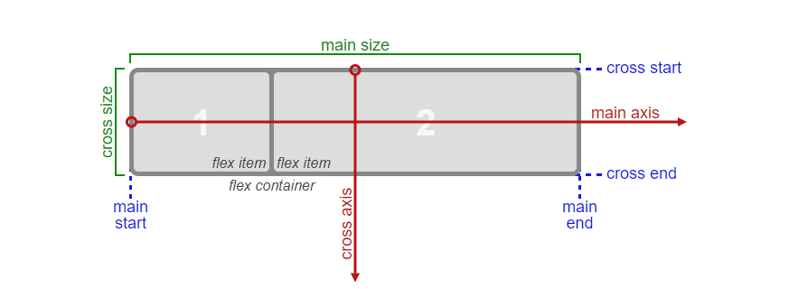

# Flexbox

Ejercicios para entender flexbox con sus conceptos más básicos

# ¿Que es Flexbox?

Es un modelo de layotu -> conjunto de algoritmos que definen como aparecerá un elemento en un flujo.
Dentro de CSS2 existen:

1.-  Block
2.- Inline
3.- Table
4.- Position

Se agregan 
Flexbox
Gri

# Notas

Los Div ya son display block
Las imagenes ya son display inline

# Main Size y Cross Size (Dimensiones de los items (hijos))

Main Size => Main Axis (por default es el width) 
Cross Size => Cross Axis (por default es el hight) 

¿Como se calcula el Cross Size?

1.- Se ha definido el tamaño y se respeta
2.- No se ha definido el tamaño y no se ha definido align-items o align-content
3.- No se define un tamaño pero si de define align-items o align-content diferente de stretch

¿Como se calcula el Main Size?

1.- Espacio disponible (espacio NO ocupado por los items), espacio ocupado (espacio ocupado por los items)
2.- Los margenes nunca se colapsan (se consideran espacio ocupado)
3.- Los items se rigen por el modelo de caja (los padding y bottom suman al tamaño de la caja - box-sizing: border-box (se calculan por dentro de la caja))
4.- El espacio dispible pordría ser positivo o negativo (por defecto si los tamaño se desborda flex lo calcula y acomoda correcto)

¿Propiedades?

flex-basis -> es el valor predeterminado (auto) y es relativo al eje principal 
flex-grow -> Como va a creecer un elemento con respecto a el flex-basis
       
       flex-grow: 1; Es el factor de crecimiento

      /*
           Espacio disponible = 100px
           suma de flex-grow = 4:
           unit grow: 100px/5 = 25px

      */

      flex-grow: 0 Nunca va a creecer

flex-shrink -> Lo opuesto a flex-grow (encogerse), cuando un espacio disponible es negativo, por defecto todos los items en flexbox tienen la propiedad flex-shrink: 1 (para evitar desbordamientos)

       flex-shrink: 1; Es el factor de crecimiento

      /*
           Espacio disponible = 500px -800px = -300px
           suma de flex-shrink = 5:
           unit shrink: -300px/5 = -60px

      */

flex -> Es propiedas abreviada (flex-grow, flex-shrink, flex-basis)

       flex-grow: 1;
       flex-shrink: 1; 
       flex-basis: 100px;

      /*
        flex: 1 1 100px;
      */

      el valor predeterminado es : flex 0 1 auto: por defecto no crecen, por defecto se comprimen y su tamañano es en relación a su contenido

       flex: none = flex: 0 0 auto (no crezcas no te reducas)
       flex: auto = flex: 1 1 auto (puedes crecer puedes reducir y tamaño en base al contenido)
       flex: n = flex: n 0 0 ()

CONCEPTO: flex-lines
PROPIEDAD: flex-wrap
SHORTHAND: flex-flow
PROPIEDAD: align-content
PROPIEDAD: order

flex-lines
   single-line
   multi-lines

align-items (cuando es multiline no funciona)
align-content

order: todos los elementos tienen order 0
   
